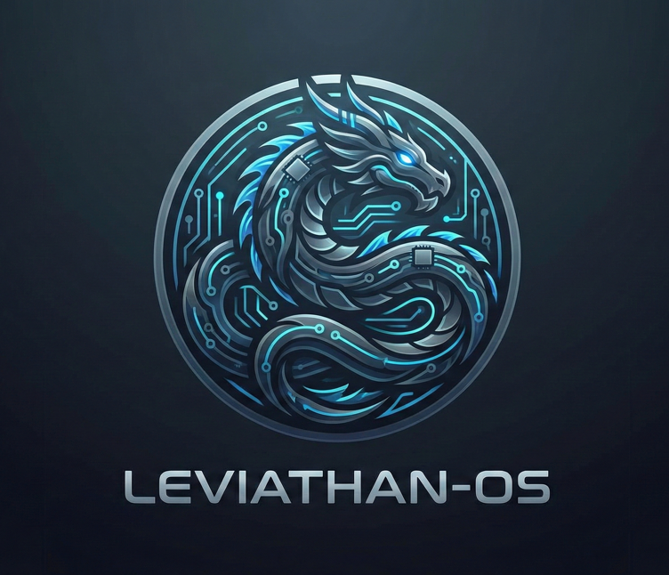

<div align="center">
  
  <h1>LEVIATHAN OS v0.2.0-alpha</h1>
  <p>
    <b>Professional-Grade Security Audit & RF Research Firmware</b>
  </p>
  <p>
    <a href="https://github.com/orach977/Leviathan-OS/releases/latest">
      
    </a>
    
    
  </p>
  <br>
</div>

---

## 📑 Table of Contents / Indice
1. [ Overview / Panoramica](#overview)
2. [ Philosophy & Stability / Filosofia e Stabilità](#philosophy)
3. [ Core Capabilities / Funzionalità Principali](#capabilities)
4. [ Reliability & Diagnostics / Affidabilità e Diagnostica](#diagnostics)
5. [ Hardware Specifications / Specifiche Hardware](#hardware)
6. [ Software Architecture / Architettura Software](#architecture)
7. [ Configuration Parameters / Parametri di Configurazione](#config)
8. [ User Interface / Interfaccia Utente](#ui)
9. [ Web Interface & API](#api)
10. [ Data Storage & Security / Archiviazione Dati e Sicurezza](#storage)
11. [ Installation & Build / Installazione e Compilazione](#install)
12. [ Legal Disclaimer / Avvertenze Legali](#legal)

---

<a name="overview"></a>
##  Overview / Panoramica

### English
LEVIATHAN OS v0.2.0-alpha  is a **safety-critical, high-reliability firmware** engineered for the ESP32-C3 RISC-V architecture. Designed for professional red teaming operations and critical infrastructure auditing, it elevates the standard of portable security devices through an industrial-grade design philosophy.

The system provides comprehensive RF spectrum analysis, WiFi security testing, BLE device emulation, and credential harvesting capabilities through a robust FreeRTOS-based architecture with deterministic memory management.

### Italiano
LEVIATHAN OS v0.1.0-alpha è un firmware **safety-critical ad alta affidabilità** ingegnerizzato per l'architettura ESP32-C3 RISC-V. Progettato per operazioni di red teaming professionale e audit di infrastrutture critiche, eleva lo standard dei dispositivi portatili di sicurezza grazie a una filosofia di derivazione industriale.

Il sistema fornisce analisi completa dello spettro RF, test di sicurezza WiFi, emulazione dispositivi BLE e raccolta credenziali attraverso un'architettura robusta basata su FreeRTOS con gestione deterministica della memoria.

---

<a name="philosophy"></a>
##  Philosophy & Stability / Filosofia e Stabilità 

### English
Unlike hobbyist tools, Leviathan is engineered to never fail during prolonged operations:

| Feature | Description |
| :--- | :--- |
| **Deterministic Runtime** | Zero-Allocation strategy - no dynamic heap allocation after initialization, eliminating fragmentation crashes |
| **Fail-Safe Boot** | Self-diagnosis of sensors and radio peripherals on startup. If a component fails, the system enters a protection state signaled by the Red LED |
| **NVS Integrity** | Magic Key validation of non-volatile storage to prevent configuration data corruption |
| **Watchdog Timer** | 5000ms reset threshold for automatic recovery from system hangs |

### Italiano
A differenza dei tool hobbistici, Leviathan è costruito per non fallire mai durante l'operatività prolungata:

| Funzionalità | Descrizione |
| :--- | :--- |
| **Runtime Deterministico** | Strategia Zero-Allocation - nessuna allocazione dinamica sulla heap dopo l'init, eliminando i crash per frammentazione di memoria |
| **Fail-Safe Boot** | Autodiagnosi dei sensori e delle periferiche radio all'avvio. Se un componente fallisce, il sistema entra in uno stato di protezione segnalato dal LED Rosso |
| **Integrità NVS** | Controllo tramite Magic Key della memoria non volatile per prevenire corruzione dei dati di configurazione |
| **Watchdog Timer** | Soglia di reset 5000ms per recupero automatico da blocchi di sistema |

---

<a name="capabilities"></a>
##  Core Capabilities / Funzionalità Principali

###  IEEE 802.11 (WiFi) Operations

#### English
| Feature | Description |
| :--- | :--- |
| **Targeted Deauthentication** | Precision deauth attacks against specific BSSIDs with configurable burst timing |
| **Beacon Flooding** | Two modes: List-based (Rickroll lyrics) and Random SSID generation for client stability testing |
| **Probe Request Sniffing** | Passive reconnaissance capturing device Preferred Network Lists (PNL) with channel hopping |
| **Evil Twin Attack** | Captive portal deployment with DNS spoofing for credential harvesting |
| **Deauth Detection** | Monitor mode for detecting deauthentication frames in the environment |

#### Italiano
| Funzionalità | Descrizione |
| :--- | :--- |
| **Deautenticazione Mirata** | Attacchi deauth precisi contro BSSID specifici con timing configurabile |
| **Beacon Flooding** | Due modalità: basata su lista (testi Rickroll) e generazione SSID random per test stabilità client |
| **Sniffing Probe Request** | Ricognizione passiva che cattura le PNL (Preferred Network Lists) dei dispositivi con channel hopping |
| **Attacco Evil Twin** | Portale captive con DNS spoofing per raccolta credenziali |
| **Rilevamento Deauth** | Modalità monitor per rilevare frame di deautenticazione nell'ambiente |

###  BLE Operations

#### English
| Feature | Description |
| :--- | :--- |
| **BLE Spoofing** | Emulates various device types: Sour, Samsung, Windows, Google for Swift Pair testing |
| **Advertisement Injection** | Custom BLE advertisement data transmission |

#### Italiano
| Funzionalità | Descrizione |
| :--- | :--- |
| **BLE Spoofing** | Emula vari tipi di dispositivi: Sour, Samsung, Windows, Google per test Swift Pair |
| **Injection Advertisement** | Trasmissione dati BLE advertisement personalizzati |

###  RF Operations (NRF24L01+)

#### English
| Feature | Description |
| :--- | :--- |
| **Spectrum Analysis** | Real-time 2.4GHz spectrum visualization with 128-channel resolution |
| **RF Jamming** | Constant carrier generation with rapid channel hopping (0-80 channels) |
| **Carrier Detection** | Active signal detection across the 2.4GHz band |

#### Italiano
| Funzionalità | Descrizione |
| :--- | :--- |
| **Analisi Spettro** | Visualizzazione spettro 2.4GHz real-time con risoluzione 128 canali |
| **RF Jamming** | Generazione carrier costante con channel hopping rapido (0-80 canali) |
| **Rilevamento Carrier** | Rilevamento segnali attivi sulla banda 2.4GHz |

---

<a name="diagnostics"></a>
##  Reliability & Diagnostics / Affidabilità e Diagnostica

### English
To meet  reliability requirements, the firmware includes an on-board Diagnostic Suite accessible via the `TEST SUITE` menu. This allows operators to verify hardware integrity before deployment.

| Test | Function | Compliance Check |
| :--- | :--- | :--- |
| **SHOW HEAP** | Real-time RAM monitor | Detects memory leaks (value must remain stable). |
| **FORCE WDT** | Simulates a CPU freeze | Verifies the Watchdog Timer. System **MUST** reboot automatically in 5s. |
| **FILL NVS** | Storage stress test | Attempts to overflow credentials storage. Verifies safety limits and memory protection. |
| **HW CHECK** | Hardware diagnostic | Verifies NRF24 radio SPI connection and WiFi stack availability. |

### Italiano
Per soddisfare i requisiti di affidabilità , il firmware include una Suite Diagnostica integrata accessibile dal menu `TEST SUITE`. Permette agli operatori di verificare l'integrità hardware prima del deployment.

| Test | Funzione | Verifica Conformità |
| :--- | :--- | :--- |
| **SHOW HEAP** | Monitor RAM real-time | Rileva memory leak (il valore deve restare stabile). |
| **FORCE WDT** | Simula freeze della CPU | Verifica il Watchdog Timer. Il sistema **DEVE** riavviarsi automaticamente in 5s. |
| **FILL NVS** | Stress test storage | Tenta di saturare l'archivio credenziali. Verifica i limiti di sicurezza e la protezione memoria. |
| **HW CHECK** | Diagnostica hardware | Verifica connessione SPI radio NRF24 e disponibilità stack WiFi. |

---

<a name="hardware"></a>
##  Hardware Specifications / Specifiche Hardware

### English
| Component | Interface | ESP32-C3 Pin | Description |
| :--- | :--- | :--- | :--- |
| **OLED SSD1306** | I2C SDA | **GPIO 0** | Serial Data Line |
| | I2C SCL | **GPIO 1** | Serial Clock Line |
| **NRF24L01+** | SPI CE | **GPIO 2** | Radio Chip Enable |
| | SPI CSN | **GPIO 8** | SPI Chip Select |
| | SPI SCK | **GPIO 6** | SPI Clock |
| | SPI MISO | **GPIO 5** | SPI MISO |
| | SPI MOSI | **GPIO 7** | SPI MOSI |
| **User Inputs** | Button A | **GPIO 9** | Confirm / Select |
| | Button B | **GPIO 10** | Back / Abort |
| | Button C | **GPIO 20** | Up Navigation |
| | Button D | **GPIO 21** | Down Navigation |
| **Diagnostics** | LED Red | **GPIO 3** | Fault / TX Activity |
| | LED Green | **GPIO 4** | System Ready / Idle |

### Italiano
| Componente | Interfaccia | Pin ESP32-C3 | Descrizione |
| :--- | :--- | :--- | :--- |
| **OLED SSD1306** | I2C SDA | **GPIO 0** | Serial Data Line |
| | I2C SCL | **GPIO 1** | Serial Clock Line |
| **NRF24L01+** | SPI CE | **GPIO 2** | Radio Chip Enable |
| | SPI CSN | **GPIO 8** | SPI Chip Select |
| | SPI SCK | **GPIO 6** | SPI Clock |
| | SPI MISO | **GPIO 5** | SPI MISO |
| | SPI MOSI | **GPIO 7** | SPI MOSI |
| **Input Utente** | Pulsante A | **GPIO 9** | Conferma / Seleziona |
| | Pulsante B | **GPIO 10** | Indietro / Annulla |
| | Pulsante C | **GPIO 20** | Navigazione Su |
| | Pulsante D | **GPIO 21** | Navigazione Giù |
| **Diagnostica** | LED Rosso | **GPIO 3** | Errore / Attività TX |
| | LED Verde | **GPIO 4** | Sistema Pronto / Idle |

> [!IMPORTANT]
> **English:** Solder a **10uF - 100uF** capacitor between VCC and GND pins of the NRF24L01+ module to prevent brownout resets.
>
> **Italiano:** Saldare un condensatore da **10uF - 100uF** tra i pin VCC e GND del modulo NRF24L01+ per prevenire reset per brownout.

---

<a name="architecture"></a>
##  Software Architecture / Architettura Software

### English
The system operates on an isolated task model using FreeRTOS to ensure UI responsiveness even during heavy RF operations:

| Task | Priority | Description |
| :--- | :--- | :--- |
| **AttackCore** | 1 (High) | Manages radio, packet injection, and microsecond timing |
| **UI_Task** | 2 (Medium) | Handles OLED rendering and button polling |
| **Net_Task** | 3 (Low) | Manages web server and API requests (when active) |

**Key Design Principles:**
- **Zero-Allocation Runtime:** No dynamic heap allocation after initialization, eliminating fragmentation crashes
- **Fail-Safe Boot:** Hardware diagnostics on startup with fault indication via Red LED
- **NVS Integrity:** Magic key validation for non-volatile storage corruption prevention
- **Thread-Safe IPC:** Mutex and Queue-based inter-process communication

### Italiano
Il sistema opera su un modello a task isolati utilizzando FreeRTOS per garantire la reattività dell'interfaccia anche durante operazioni RF pesanti:

| Task | Priorità | Descrizione |
| :--- | :--- | :--- |
| **AttackCore** | 1 (Alta) | Gestisce radio, iniezione pacchetti e timing microsecondi |
| **UI_Task** | 2 (Media) | Gestisce rendering OLED e polling pulsanti |
| **Net_Task** | 3 (Bassa) | Gestisce server web e richieste API (quando attivo) |

**Principi di Design Chiave:**
- **Runtime Zero-Allocation:** Nessuna allocazione dinamica sulla heap dopo l'inizializzazione, eliminando crash per frammentazione
- **Fail-Safe Boot:** Diagnostica hardware all'avvio con indicazione guasto tramite LED Rosso
- **Integrità NVS:** Validazione tramite Magic Key per prevenire corruzione memoria non volatile
- **IPC Thread-Safe:** Comunicazione inter-processo basata su Mutex e Code |

#### Task Configuration / Configurazione Task
| Parameter | Value | Description / Descrizione |
| :--- | :--- | :--- |
| `ATTACK_TASK_STACK` | 8192 bytes | Stack size for attack task / Dimensione stack task attacco |
| `ATTACK_TASK_PRIO` | 1 | Attack task priority (high) / Priorità task attacco (alta) |
| `WEB_PORT` | 80 | Web server port / Porta server web |
| `WEB_SESSION_TIMEOUT` | 300000ms | Web session timeout (5 minutes) / Timeout sessione web (5 minuti) |

---

<a name="config"></a>
##  Configuration Parameters / Parametri di Configurazione

### English
The system supports two operational modes and two resource profiles configured in [`config.h`](config.h:20):

#### Operational Modes
| Mode | Description | Serial Log | Log Level |
| :--- | :--- | :--- | :--- |
| **MODE_DEV** | Development mode with debug output | Enabled | DEBUG (4) |
| **MODE_OPS** | Operations mode for stealth deployment | Disabled | ERROR (1) |

#### Resource Profiles
| Profile | Input Buffer | Max Logs | Max Creds | Max Scan Results |
| :--- | :--- | :--- | :--- | :--- |
| **PROFILE_PERFORMANCE** | 128 bytes | 100 | 50 | 50 |
| **PROFILE_STEALTH** | 64 bytes | 20 | 10 | 15 |

#### Timing Parameters
| Parameter | Value | Description |
| :--- | :--- | :--- |
| `DEAUTH_PACKET_DELAY` | 10ms | Delay between deauth packets |
| `DEAUTH_BURST_SIZE` | 5 | Number of packets per burst |
| `CHANNEL_HOP_DELAY` | 150ms | Delay between channel hops |
| `JAMMER_HOP_SPEED` | 50ms | RF jammer channel hop speed |
| `WATCHDOG_TIMEOUT_MS` | 5000ms | Watchdog reset threshold |
| `MIN_RSSI_THRESHOLD` | -85 dBm | Minimum signal strength for targets |

#### Display Configuration
| Parameter | Value | Description |
| :--- | :--- | :--- |
| `SCREEN_W` | 128 | OLED display width |
| `SCREEN_H` | 32 | OLED display height |
| `OLED_ADDR` | 0x3C | I2C address |
| `OLED_CONTRAST` | 0xFF | Display contrast |

### Italiano
Il sistema supporta due modalità operative e due profili risorse configurabili in [`config.h`](config.h:20):

#### Modalità Operative
| Modalità | Descrizione | Log Seriale | Livello Log |
| :--- | :--- | :--- | :--- |
| **MODE_DEV** | Modalità sviluppo con output debug | Abilitato | DEBUG (4) |
| **MODE_OPS** | Modalità operativa per deployment stealth | Disabilitato | ERROR (1) |

#### Profili Risorse
| Profilo | Buffer Input | Max Log | Max Cred | Max Risultati Scan |
| :--- | :--- | :--- | :--- | :--- |
| **PROFILE_PERFORMANCE** | 128 byte | 100 | 50 | 50 |
| **PROFILE_STEALTH** | 64 byte | 20 | 10 | 15 |

#### Parametri Timing
| Parametro | Valore | Descrizione |
| :--- | :--- | :--- |
| `DEAUTH_PACKET_DELAY` | 10ms | Ritardo tra pacchetti deauth |
| `DEAUTH_BURST_SIZE` | 5 | Numero di pacchetti per burst |
| `CHANNEL_HOP_DELAY` | 150ms | Ritardo tra salti di canale |
| `JAMMER_HOP_SPEED` | 50ms | Velocità hop jammer RF |
| `WATCHDOG_TIMEOUT_MS` | 5000ms | Soglia reset watchdog |
| `MIN_RSSI_THRESHOLD` | -85 dBm | Potenza segnale minima per target |

#### Configurazione Display
| Parametro | Valore | Descrizione |
| :--- | :--- | :--- |
| `SCREEN_W` | 128 | Larghezza display OLED |
| `SCREEN_H` | 32 | Altezza display OLED |
| `OLED_ADDR` | 0x3C | Indirizzo I2C |
| `OLED_CONTRAST` | 0xFF | Contrasto display |

---

<a name="ui"></a>
##  User Interface / Interfaccia Utente

### English
The device features a 128x32 OLED display with a hierarchical menu system controlled by 4 buttons:

#### Button Functions
| Button | GPIO | Function |
| :--- | :--- | :--- |
| **A** | GPIO 9 | Confirm / Select |
| **B** | GPIO 10 | Back / Abort / Stop Attack |
| **C** | GPIO 20 | Navigate Up |
| **D** | GPIO 21 | Navigate Down |

#### Menu Structure
```
Main Menu
├── WIFI OPS
│   ├── SCAN TARGETS
│   ├── DEAUTH TGT
│   ├── BEACON FLOOD
│   ├── PROBE SNIFF
│   └── BACK
├── BLE OPS
│   ├── APPLE SOUR
│   ├── SAMSUNG
│   ├── WINDOWS
│   ├── GOOGLE
│   └── BACK
├── RF24 OPS
│   ├── SPECTRUM
│   ├── JAMMER
│   ├── CARRIER DETECT
│   └── BACK
├── EVIL TWIN
│   ├── START
│   ├── STOP
│   ├── VIEW CREDS
│   └── BACK
├── DEFENSE
│   ├── DEAUTH DETECT
│   ├── LOGS
│   └── BACK
└── TEST SUITE
    ├── SHOW HEAP
    ├── FORCE WDT
    ├── FILL NVS
    ├── HW CHECK
    └── BACK
```

### Italiano
Il dispositivo dispone di un display OLED 128x32 con un sistema menu gerarchico controllato da 4 pulsanti:

#### Funzioni Pulsanti
| Pulsante | GPIO | Funzione |
| :--- | :--- | :--- |
| **A** | GPIO 9 | Conferma / Seleziona |
| **B** | GPIO 10 | Indietro / Annulla / Ferma Attacco |
| **C** | GPIO 20 | Navigazione Su |
| **D** | GPIO 21 | Navigazione Giù |

#### Struttura Menu
```
Menu Principale
├── WIFI OPS
│   ├── SCAN TARGETS
│   ├── DEAUTH TGT
│   ├── BEACON FLOOD
│   ├── PROBE SNIFF
│   └── BACK
├── BLE OPS
│   ├── APPLE SOUR
│   ├── SAMSUNG
│   ├── WINDOWS
│   ├── GOOGLE
│   └── BACK
├── RF24 OPS
│   ├── SPECTRUM
│   ├── JAMMER
│   ├── CARRIER DETECT
│   └── BACK
├── EVIL TWIN
│   ├── START
│   ├── STOP
│   ├── VIEW CREDS
│   └── BACK
├── DEFENSE
│   ├── DEAUTH DETECT
│   ├── LOGS
│   └── BACK
└── TEST SUITE
    ├── SHOW HEAP
    ├── FORCE WDT
    ├── FILL NVS
    ├── HW CHECK
    └── BACK
```

---

<a name="api"></a>
##  Web Interface & API

### English
The device provides two web interface modes:

#### C2 Mode (Command & Control)
- **AP SSID:** `LEVIATHAN_NET`
- **Password:** Configurable in [`config.h`](config.h:99)
- **Purpose:** Remote control and monitoring

#### Evil Twin Mode
- **AP SSID:** `Free WiFi`
- **Password:** Open network
- **Purpose:** Credential harvesting via captive portal

#### REST API Endpoints

| Method | Endpoint | Parameters | Description |
| :--- | :--- | :--- | :--- |
| `GET` | `/api/scan` | - | Initiates passive WiFi/BLE target scan |
| `GET` | `/api/attack` | `b` (BSSID), `c` (Channel) | Starts deauth attack on target |
| `GET` | `/api/stop` | - | Emergency halt: stops all RF transmission |
| `GET` | `/api/status` | - | Returns system status and packet counts |

### Italiano
Il dispositivo fornisce due modalità di interfaccia web:

#### Modalità C2 (Command & Control)
- **AP SSID:** `LEVIATHAN_NET`
- **Password:** Configurabile in [`config.h`](config.h:99)
- **Scopo:** Controllo remoto e monitoraggio

#### Modalità Evil Twin
- **AP SSID:** `Free WiFi`
- **Password:** Rete aperta
- **Scopo:** Raccolta credenziali tramite portale captive

#### Endpoint REST API

| Metodo | Endpoint | Parametri | Descrizione |
| :--- | :--- | :--- | :--- |
| `GET` | `/api/scan` | - | Avvia scansione passiva target WiFi/BLE |
| `GET` | `/api/attack` | `b` (BSSID), `c` (Canale) | Avvia attacco deauth sul target |
| `GET` | `/api/stop` | - | Arresto emergenza: ferma ogni trasmissione RF |
| `GET` | `/api/status` | - | Restituisce stato sistema e conteggio pacchetti |

---

<a name="storage"></a>
##  Data Storage & Security / Archiviazione Dati e Sicurezza

### English
The system uses ESP32's Non-Volatile Storage (NVS) for persistent data with integrity protection:

#### Stored Data
| Data Type | Description | Storage Limit |
| :--- | :--- | :--- |
| **Target Settings** | Last used BSSID and channel | 1 entry |
| **Captured Credentials** | User:password pairs from Evil Twin | 10-50 entries (profile dependent) |
| **Handshake Logs** | Captured WPA handshakes | 20-100 entries (profile dependent) |
| **Probe Logs** | Captured probe requests | 20-100 entries (profile dependent) |
| **Deauth Count** | Counter for detected deauth frames | 1 entry |

#### Security Features
| Feature | Description |
| :--- | :--- |
| **Magic Key Validation** | NVS integrity check using `0x4C563231` ("LV21") signature |
| **Input Validation** | BSSID format and channel range validation |
| **Overflow Protection** | Buffer size limits prevent memory corruption |
| **Dynamic Password** | Optional salted password generation for C2 mode |

### Italiano
Il sistema utilizza la memoria non volatile (NVS) dell'ESP32 per dati persistenti con protezione integrità:

#### Dati Archiviati
| Tipo Dato | Descrizione | Limite Archiviazione |
| :--- | :--- | :--- |
| **Impostazioni Target** | Ultimo BSSID e canale utilizzati | 1 entry |
| **Credenziali Catturate** | Coppie utente:password da Evil Twin | 10-50 entry (dipendente dal profilo) |
| **Log Handshake** | Handshake WPA catturati | 20-100 entry (dipendente dal profilo) |
| **Log Probe** | Probe request catturati | 20-100 entry (dipendente dal profilo) |
| **Contatore Deauth** | Contatore per frame deauth rilevati | 1 entry |

#### Funzionalità di Sicurezza
| Funzionalità | Descrizione |
| :--- | :--- |
| **Validazione Magic Key** | Controllo integrità NVS usando firma `0x4C563231` ("LV21") |
| **Validazione Input** | Validazione formato BSSID e range canale |
| **Protezione Overflow** | Limiti dimensione buffer prevengono corruzione memoria |
| **Password Dinamica** | Generazione password con salt opzionale per modalità C2 |

---

<a name="install"></a>
##  Installation & Build / Installazione e Compilazione

### 📦 Pre-built Binaries / Binari Pre-compilati

**Version v0.1.0-alpha is now available!**
Pre-compiled firmware binaries are available in the releases section for immediate flashing.

---

### English

#### Prerequisites
- ESP32-C3 development board
- OLED SSD1306 display (128x32)
- NRF24L01+ radio module
- 4x push buttons
- 2x LEDs (Red, Green)

#### PlatformIO (Recommended)
1. Clone the repository:
   ```bash
   git clone https://github.com/orach977/Leviathan-OS
   ```
2. Open the folder in VS Code with PlatformIO extension
3. Configure [`config.h`](config.h:20):
   ```cpp
   #define SYSTEM_MODE         MODE_OPS      // MODE_OPS for stealth, MODE_DEV for debug
   #define RESOURCE_PROFILE    PROFILE_PERFORMANCE  // PERFORMANCE or STEALTH
   ```
4. Build & Flash:
   ```bash
   pio run -t upload
   ```

#### Arduino IDE
1. Install ESP32 board support (v2.0.5+)
2. Install required libraries:
   - `Adafruit GFX`
   - `Adafruit SSD1306`
   - `RF24 by TMRh20`
   - `BLEDevice` (included with ESP32)
3. Open [`main.cpp`](main.cpp:1) and upload

### Italiano

#### Prerequisiti
- Scheda di sviluppo ESP32-C3
- Display OLED SSD1306 (128x32)
- Modulo radio NRF24L01+
- 4 pulsanti
- 2 LED (Rosso, Verde)

#### PlatformIO (Raccomandato)
1. Clona la repository:
   ```bash
   git clone https://github.com/orach977/Leviathan-OS
   ```
2. Apri la cartella in VS Code con l'estensione PlatformIO
3. Configura [`config.h`](config.h:20):
   ```cpp
   #define SYSTEM_MODE         MODE_OPS      // MODE_OPS per stealth, MODE_DEV per debug
   #define RESOURCE_PROFILE    PROFILE_PERFORMANCE  // PERFORMANCE o STEALTH
   ```
4. Compila e Flasha:
   ```bash
   pio run -t upload
   ```

#### Arduino IDE
1. Installa il supporto per schede ESP32 (v2.0.5+)
2. Installa le librerie richieste:
   - `Adafruit GFX`
   - `Adafruit SSD1306`
   - `RF24 by TMRh20`
   - `BLEDevice` (inclusa con ESP32)
3. Apri [`main.cpp`](main.cpp:1) e carica

---

<a name="legal"></a>
##  Legal Disclaimer / Avvertenze Legali

### English
This software is provided strictly for **educational purposes** and **authorized security auditing**. Use of this tool on networks or devices without explicit written permission is illegal and may violate local, state, and federal laws. The authors assume no liability for damages or misuse of this software.

**Authorized Use Only:**
- Security research with written consent
- Penetration testing under contract
- Educational demonstrations in controlled environments

### Italiano
Questo software è fornito rigorosamente per **scopi educativi** e **audit di sicurezza autorizzati**. L'uso di questo strumento su reti o dispositivi senza esplicito permesso scritto è illegale e può violare leggi locali, statali e federali. Gli autori non si assumono alcuna responsabilità per danni o usi impropri di questo software.

**Uso Autorizzato Solo:**
- Ricerca sulla sicurezza con consenso scritto
- Penetration testing sotto contratto
- Dimostrazioni educative in ambienti controllati

---

##  Project Structure / Struttura del Progetto

```
Leviathan-os/
├── main.cpp              # Entry point with FreeRTOS task creation
├── config.h              # System configuration and pin definitions
├── types.h               # Data structures and enumerations
├── attacks.h/cpp         # WiFi/BLE/RF attack engine implementation
├── hardware.h/cpp        # Hardware abstraction layer (OLED, NRF24, GPIO)
├── ui.h/cpp              # Menu system and OLED rendering
├── web_interface.h/cpp   # Web server and captive portal
└── README.md             # This file
```

---

**Developed by:** [ORACH977](https://github.com/orach977)

**License:** Proprietary - For Authorized Security Research Only

**Copyright:** © 2026. All rights reserved.


